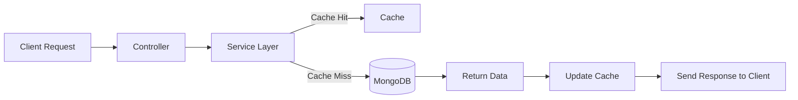

# 🐾PetConnect Backend

> Scalable microservice backend powering intelligent pet adoption, fostering, and shelter management.

---

## Quick Start

1. Copy `.env.example` → `.env` and update configuration values.  
2. Install dependencies:  

   ```bash
   npm install
   ```

3. Start development server (with **nodemon**):  

   ```bash
   npm run dev
   ```

4. Start production server:  

   ```bash
   npm start
   ```

---

## Scripts

| Command | Description |
|----------|-------------|
| `npm run dev` | Start dev server with nodemon |
| `npm run lint` | Run ESLint for code quality |
| `npm run format` | Run Prettier for consistent formatting |
| `npm start` | Start production server (`node index.js`) |

---

## Architecture

- **Framework:** Node.js + Express  
- **Database:** MongoDB (via Mongoose)  
- **Architecture Pattern:** MVCS (Model–View–Controller–Service)  
- **Collections:** `users`, `pets`, `organizations`, `appointments`, `analytics`, etc.  
- **Deployment:** Independent microservice (Docker / Render / Railway / Kubernetes)

---

## Why MVCS + Caching Instead of MVCSR (with Repositories)

As a team of four developers, our priority is **building scalable, performant features quickly** — not overengineering abstractions.

### Practical Simplicity

The **MVCS** (Model–View–Controller–Service) pattern provides clear separation of concerns:

- **Models** define database schemas and validations.  
- **Controllers** handle routing and API flow.  
- **Services** manage all business logic and integrate caching.  
- **Views** define response structures (for API or admin UI).  

Adding **Repositories** (MVCSR) introduces extra abstraction layers — often duplicating logic already handled by Mongoose and slowing development.

### Real Performance Gains

Instead of abstraction, we focused on **caching**, which directly improves user experience:

- **10–100× faster responses** for frequently accessed data (e.g., pet listings, user profiles).  
- Reduced database load through **service-level caching** (Redis-ready, easily extensible).  
- Enables both **speed** and **scalability** with minimal code overhead.

### Future-Ready

This architecture is:

- **Modular** — each service is independently testable.  
- **Flexible** — can evolve to Redis or distributed cache tiers later.  
- **Maintainable** — simple for a small, fast-moving team without losing clarity.

> **In short:** MVCS + Caching gives us *clarity, performance, and scalability* — without the complexity that repository layers add.

---

## Tech Stack

| Layer | Technology / Library |
|-------|----------------------|
| **Runtime** | Node.js (v18+) |
| **Framework** | Express.js |
| **Database** | MongoDB + Mongoose |
| **Authentication** | JWT (JSON Web Tokens) |
| **File Uploads** | Multer + Cloudinary |
| **Email Service** | Nodemailer |
| **Payments** | Stripe |
| **Blockchain Integration** | Web3.js + Hardhat |
| **PDF Generation** | PDFKit, PDF-Lib, @pdf-lib/fontkit |
| **Image Processing** | Canvas |
| **Real-Time Communication** | Socket.io |
| **HTTP Client** | Axios / node-fetch |
| **Environment Management** | dotenv |
| **Validation & Security** | bcryptjs, cors |
| **Caching** | Service-level in-memory (Redis-ready) |
| **Testing** | Supertest |
| **Linting & Formatting** | ESLint + Prettier |

---

## Environment Variables

Create a `.env` file in the root directory with:

```bash
# Server
PORT=5000
NODE_ENV=development

# Database
MONGO_URI=mongodb+srv://...

# JWT Auth
JWT_SECRET=your_jwt_secret_key

# Cloudinary
CLOUDINARY_CLOUD_NAME=...
CLOUDINARY_API_KEY=...
CLOUDINARY_API_SECRET=...

# Stripe
STRIPE_SECRET_KEY=...

# Email
EMAIL_USER=...
EMAIL_PASS=...

# Blockchain / Web3
WALLET_PRIVATE_KEY=...
INFURA_PROJECT_ID=...
```

---

## Folder Structure

```PetConnectBackend/
│
├── controllers/        # Route controllers (API logic)
├── models/             # Mongoose models and schemas
├── services/           # Business logic + caching layer
├── routes/             # Express routes
├── config/             # DB and environment configuration
├── utils/              # Helpers and shared utilities
├── public/             # Static files (if any)
├── index.js / server.js# Entry point
└── .env.example        # Environment variable template
```

---

## MVCS + Caching Flow



---

## Notes for Code Review

- **Entry Point:** `server.js` or `index.js`  
- **Models:** Defined using `mongoose.Schema`  
- **Services:** Contain core logic and caching mechanisms  
- **Controllers:** Manage request-response flow  
- **Docs:** Add ER diagrams or model documentation here  

---

## License

This project is licensed under the **MIT License** — free to use, modify, and distribute.

---

> 🧡 **PetConnect Backend** — built for performance, simplicity, and real-world scalability.
